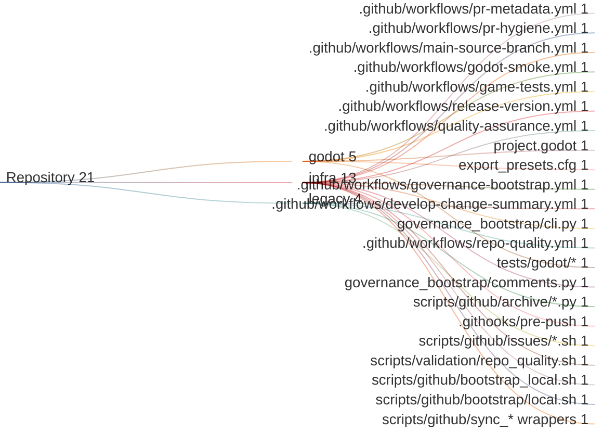

# Workflow Map

This is the canonical inventory of the repository's workflows, local pipelines, and GitHub interaction helpers.
It uses three project-area buckets so the same groups can be reused in the tables and the Sankey diagram.

## Workflows and Pipelines

| Path | Area | Trigger / entrypoint | Purpose | Key dependencies | Status |
| --- | --- | --- | --- | --- | --- |
| `.github/workflows/pr-metadata.yml` | `infra` | `pull_request_target` on `opened`, `synchronize`, `reopened`, `edited` | Validate branch naming and PR body contract before the review flow starts. | `scripts/validation/validate_pr_body.py`, PR template | Active |
| `.github/workflows/pr-hygiene.yml` | `infra` | `pull_request_target` on PR lifecycle events | Sync PR labels, milestone, assignees, linked task relationship, and Project status from the linked task. | `governance_bootstrap.pr_hygiene`, `GOVERNANCE_PAT`, `GOVERNANCE_PROJECT_NUMBER` | Active |
| `.github/workflows/main-source-branch.yml` | `infra` | `pull_request` targeting `main` | Enforce that `main` is merged from `develop` in the same repository. | GitHub PR metadata only | Active |
| `.github/workflows/release-version.yml` | `infra` | `pull_request_target` to `main`, plus `closed` merge handling | Plan releases from the PR body, update linked `develop` PRs, export Godot builds, create the tag and GitHub Release, and attach release assets. | `governance_bootstrap.release`, `export_presets.cfg`, Godot export templates | Active |
| `.github/workflows/quality-assurance.yml` | `infra` | `pull_request` on `opened`, `synchronize`, `reopened` | Check segment coverage for gameplay changes and upsert a sticky PR comment for same-repo PRs. | `.githooks/pre-push` coverage approval refs, `git diff --name-status`, `actions/github-script` | Active |
| `.github/workflows/godot-smoke.yml` | `godot` | `pull_request` | Lightweight Godot boot check when the project file exists. | `project.godot`, Godot runner | Active |
| `.github/workflows/game-tests.yml` | `godot` | `pull_request` path filter plus `workflow_dispatch` | Refined Godot gameplay suite for player, obstacle, chunk, and game-flow behavior. | `tests/godot/*`, `godot-gdunit-labs/gdUnit4-action@v1.3.1` | Active |
| `.github/workflows/governance-bootstrap.yml` | `infra` | `workflow_dispatch` | Manual sync of labels, milestones, project setup, and issue generation. | `governance_bootstrap.cli`, `GOVERNANCE_PAT` | Active |
| `.github/workflows/develop-change-summary.yml` | `legacy` | `pull_request_target` to `develop` | Legacy grouped change summary for PRs opened against `develop`. | `governance_bootstrap.release` summary helpers | Legacy |
| `.github/workflows/repo-quality.yml` | `legacy` | Repository workflow check | Historical workflow-level baseline gate. Its responsibilities now live in `scripts/validation/repo_quality.sh`. | `scripts/validation/repo_quality.sh` | Retired |
| `.githooks/pre-push` | `infra` | Local Git hook | Path-gated checks before push. Runs only the checks that match the files changed in the push. | Bash 4.3+, Git upstream detection, syntax/lint checks | Local-only |
| `scripts/validation/repo_quality.sh` | `infra` | Local validation script | Baseline file check used by local validation and bootstrap flows. | Repo layout, contract tests | Local-only |

### Notes

- `pr-hygiene.yml` depends on PR bodies linking tasks with `Closes #N`, `Fixes #N`, or `Resolves #N`.
- `release-version.yml` depends on the release CLI path (`python -m governance_bootstrap release ...`) and `export_presets.cfg`.
- `godot-smoke.yml` is only a bootstrap check; `game-tests.yml` is the refined gameplay suite.
- `repo-quality.yml` is retired. The living baseline now sits in `scripts/validation/repo_quality.sh`.
- `.githooks/pre-push` requires Bash 4.3+; macOS contributors should not run it with the default `/bin/bash` 3.2.

## Areas

These are the project-area buckets used throughout this file and the Sankey diagram.

| Area | Scope | Typical entries |
| --- | --- | --- |
| `godot` | Gameplay content, Godot engine checks, and game-test fixtures. | `godot-smoke.yml`, `game-tests.yml`, `project.godot`, `export_presets.cfg`, `tests/godot/*` |
| `infra` | Repository policy, release automation, GitHub helpers, and local validation. | `pr-metadata.yml`, `pr-hygiene.yml`, `main-source-branch.yml`, `release-version.yml`, `governance-bootstrap.yml`, `governance_bootstrap/cli.py`, `governance_bootstrap/comments.py`, `.githooks/pre-push`, `scripts/validation/repo_quality.sh` |
| `legacy` | Retired or compatibility-only automation. | `develop-change-summary.yml`, `repo-quality.yml`, `scripts/github/archive/*.py`, `scripts/github/issues/*.sh` |

## GitHub Interaction Helpers

| Path | Area | Kind | Purpose | Status |
| --- | --- | --- | --- | --- |
| `governance_bootstrap/cli.py` | `infra` | Python CLI entrypoint | Routes repository governance commands for labels, milestones, issues, project sync, release planning, and release publishing. | Active |
| `governance_bootstrap/comments.py` | `infra` | Python helper | Reads, creates, updates, and deletes marked issue comments used by the release flow. | Active |
| `scripts/github/bootstrap_local.sh` | `infra` | Shell orchestrator | Runs the local governance bootstrap sequence for labels, milestones, projects, and issue generation. | Active |
| `scripts/github/bootstrap/local.sh` | `infra` | Shell wrapper | Compatibility wrapper that forwards to `scripts/github/bootstrap_local.sh`. | Active |
| `scripts/github/labels/sync.py`, `scripts/github/milestones/sync.py`, `scripts/github/issues/generate.py`, `scripts/github/project/sync.py`, `scripts/github/project/create.py`, `scripts/github/issue_milestones/sync.py` | `infra` | Thin Python wrappers | Convenience entrypoints that forward into the shared CLI. | Active |
| `scripts/github/archive/*.py` | `legacy` | Thin Python wrappers | Superseded flat-path wrappers (same interface as the active organized versions). Kept for reference. | Archived |
| `scripts/github/issues/create.sh`, `scripts/github/issues/update.sh`, `scripts/github/issues/delete.sh` | `legacy` | Shell wrappers | Dead wrappers around `gh issue ...`. The Makefile now calls `gh` directly. | Dead |

## Practical Reading Order

1. Start with the workflow table when you need to know what runs in GitHub Actions.
2. Check the helper table when you need to know which local scripts are wrappers versus real entrypoints.
3. Use the notes to distinguish the active Godot suite from the smoke check and to spot legacy automation that should not be treated as current policy.

## Visualization

This Sankey uses the project-area buckets above so the diagram stays aligned with the tables.

